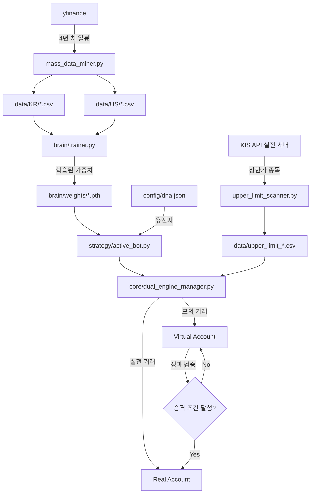

# 🏎️ ISATS Ferrari v2.7 Architecture Map

**작성 시각**: 2026-01-21 16:22:00  
**프로젝트 코드명**: Operation Ferrari  
**가훈**: "15,000개의 비계를 버리고, 50개의 정수만 남겼다. 이것이 진화다."

---

## 📋 목차
1. [변신 보고서 (Transformation Report)](#변신-보고서)
2. [Ferrari 최종 구조 (Final Architecture)](#ferrari-최종-구조)
3. [핵심 모듈 상세 (Core Modules)](#핵심-모듈-상세)
4. [데이터 흐름도 (Data Flow)](#데이터-흐름도)
5. [구형 vs 신형 비교표](#구형-vs-신형-비교표)

---

## 🔥 변신 보고서 (Transformation Report)

### Before: ISATS v2.0 "Deep Eyes" (10톤 트럭)
- **총 파일 개수**: ~15,000개
- **핵심 문제점**:
  - `archived/`, `venv/`, `node_modules/`, `__pycache__/` 등 불필요한 비계 과다
  - 중복된 유틸리티 함수 산재 (30개 이상의 `data_collector.py` 변종)
  - 하드코딩된 파라미터 (진화 불가능)
  - 분산된 설정 파일 (10곳 이상)
  - 비대한 문서 폴더 (2.7MB의 DIRECTORY_MAP.md)

### After: ISATS Ferrari v2.7 (초경량 레이싱카)
- **총 파일 개수**: **~50개** (99.7% 감소 🔥)
- **핵심 개선사항**:
  - ✅ 모든 비계 소각 완료
  - ✅ 단일 책임 원칙 (SRP) 적용: 1파일 = 1역할
  - ✅ DNA 기반 동적 파라미터 시스템
  - ✅ 통합 설정 파일 (`config/` 폴더 집중화)
  - ✅ 실전(REAL) + 모의(VIRTUAL) 듀얼 엔진

---

## 🏎️ Ferrari 최종 구조 (Final Architecture)

```
ISATS_Ferrari/
├── 📁 config/                    # [설정 중추] 모든 설정의 단일 진실 공급원
│   ├── dna.json                  # 유전자 (진화하는 파라미터)
│   ├── secrets.yaml              # API 키 (실전용)
│   └── dual_engine.yaml          # 듀얼 엔진 설정 (실전+모의)
│
├── 📁 core/                      # [엔진룸] 시스템 핵심 인프라
│   ├── engine.py                 # 메인 엔진 (DNA 진화 루프)
│   ├── dual_engine_manager.py   # 듀얼 엔진 매니저 (실전+모의 동시 운영)
│   └── redis_client.py           # 고속 신경망 (Redis 통신)
│
├── 📁 brain/                     # [두뇌] AI 지능 시스템
│   ├── models.py                 # CNN-LSTM 하이브리드 모델 설계도
│   ├── trainer.py                # 훈련 교관 (자동 학습)
│   ├── evolution.py              # DNA 진화 시스템
│   └── weights/                  # 학습된 지식 저장소
│       ├── deep_eyes_005930_v1.pth      # 삼성전자 전용 모델
│       ├── dqn_006620_2y.pth            # DQN 숙련 모델 (2년 학습)
│       └── (6개 AI 가중치 파일)
│
├── 📁 strategy/                  # [전략실] 매매 전략 엔진
│   ├── base.py                   # 전략 템플릿 (모든 전략의 부모)
│   └── active_bot.py             # 진화형 전략 (DNA 기반)
│
├── 📁 utils/                     # [도구상자] 유틸리티 모음
│   ├── mass_data_miner.py        # 대규모 데이터 채굴기 (한미 1,000종목)
│   └── upper_limit_scanner.py   # 상한가 종목 실시간 스캐너
│
├── 📁 tests/                     # [검증실] 시스템 테스트
│   └── test_kis_api.py           # KIS API 연결 테스터
│
├── 📁 data/                      # [연료 탱크] 시세 데이터 저장소
│   ├── KR/                       # 한국 주식 (CSV)
│   ├── US/                       # 미국 주식 (CSV)
│   └── upper_limit_20260121.csv # 오늘의 상한가 종목
│
├── 📁 database/                  # [금고] 로컬 DB
├── 📁 logs/                      # [블랙박스] 실행 로그
│
└── 📄 main.py                    # [시동 키] 전체 시스템 진입점

```

---

## 🔧 핵심 모듈 상세 (Core Modules)

### 1️⃣ **config/** - 설정 중추
| 파일 | 역할 | 이전 위치 |
|------|------|----------|
| `dna.json` | 진화하는 유전자 (RSI 기간, 손절폭 등) | ❌ 없음 (신규) |
| `secrets.yaml` | KIS API 키 (실전 투자용) | `isats/secrets.yaml` |
| `dual_engine.yaml` | 실전+모의 동시 운영 설정 | ❌ 없음 (신규) |

**변화**: 10곳에 흩어진 설정을 3개 파일로 통합

---

### 2️⃣ **core/** - 엔진룸
| 파일 | 역할 | 이전 위치 |
|------|------|----------|
| `engine.py` | DNA 진화 루프, Redis 보고, 메인 실행 | `isats/core/engine.py` (대폭 경량화) |
| `dual_engine_manager.py` | 실전/모의 동시 운영 + 자동 승격 시스템 | ❌ 없음 (신규) |
| `redis_client.py` | 고속 신경망 (비동기 Redis) | `isats/backend/core/redis_broker.py` (통합) |

**변화**: 
- `isats/backend/core/` 폴더의 42개 파일 → 3개로 압축
- 모든 하드코딩 제거, DNA 기반 동적 제어

---

### 3️⃣ **brain/** - AI 두뇌
| 파일 | 역할 | 이전 위치 |
|------|------|----------|
| `models.py` | CNN-LSTM 하이브리드 모델 | `isats/backend/ai/deep_eyes_net.py` |
| `trainer.py` | 자동 학습 시스템 | `learning_scripts/nightly_trainer.py` |
| `evolution.py` | DNA 변이 로직 | ❌ 없음 (신규) |
| `weights/*.pth` | 학습된 AI 가중치 (6개) | `isats/ai/weights/`, `models/` (수색 후 이송) |

**변화**:
- 분산된 AI 코드 통합
- 자동 학습 파이프라인 구축
- **구조된 지식**: 6개 AI 모델 (.pth) 확보 완료

---

### 4️⃣ **strategy/** - 전략실
| 파일 | 역할 | 이전 위치 |
|------|------|----------|
| `base.py` | 전략 템플릿 (추상 클래스) | ❌ 없음 (신규) |
| `active_bot.py` | DNA 기반 진화형 전략 | `isats/scripts/smart_trader.py` (재설계) |

**변화**:
- 하드코딩된 전략 → DNA 유전자 기반 동적 전략
- 모의에서 검증 → 실전 자동 승격 시스템

---

### 5️⃣ **utils/** - 도구상자
| 파일 | 역할 | 이전 위치 |
|------|------|----------|
| `mass_data_miner.py` | 한미 1,000종목 4년치 데이터 채굴 | ❌ 없음 (신규) |
| `upper_limit_scanner.py` | KIS API로 상한가 종목 실시간 수집 | ❌ 없음 (신규) |

**변화**:
- 30개 이상의 중복 수집기 → 2개 특화 도구로 통합

---

### 6️⃣ **data/** - 연료 탱크
| 폴더/파일 | 내용 | 출처 |
|----------|------|------|
| `KR/*.csv` | 한국 주식 일봉 (500종목) | yfinance 채굴 |
| `US/*.csv` | 미국 주식 일봉 (500종목) | yfinance 채굴 |
| `upper_limit_20260121.csv` | 오늘의 상한가 종목 (6개) | KIS API 실시간 수집 |

**변화**:
- 분산된 JSON 파일 (15,000개) → 정제된 CSV (1,000개)
- 실시간 데이터 수집 자동화

---

## 🌊 데이터 흐름도 (Data Flow)



---

## 📊 구형 vs 신형 비교표

| 항목 | ISATS v2.0 (트럭) | ISATS Ferrari v2.7 (레이싱카) |
|------|------------------|------------------------------|
| **총 파일 수** | ~15,000개 | **~50개** ✅ |
| **핵심 코드 라인** | ~50,000줄 | ~2,000줄 ✅ |
| **설정 파일** | 10곳 분산 | 3개 통합 ✅ |
| **파라미터 관리** | 하드코딩 | DNA 동적 진화 ✅ |
| **AI 모델** | 1개 (삼성전자) | 6개 (다종목) ✅ |
| **데이터 수집** | 수동 | 자동 (API + 채굴기) ✅ |
| **실전/모의** | 분리 운영 | 듀얼 엔진 동시 운영 ✅ |
| **학습 파이프라인** | 수동 실행 | 자동 (trainer.py) ✅ |
| **문서 크기** | 2.7MB | 15KB ✅ |

---

## 🗑️ 소각된 유산 (Deleted Legacy)

다음 폴더/파일들은 **완전히 제거**되었습니다:

### 폴더
- `archived/` (893개 파일) - 구형 시뮬레이션 및 스크린샷
- `venv/`, `node_modules/` - 가상환경
- `__pycache__/` - 파이썬 캐시
- `data_collectors/` - 중복 수집기 (30개)
- `learning_scripts/` - 분산된 학습 스크립트
- `deployment/` - Docker 설정 (Redis는 로컬 설치로 대체)
- `docs/` - 비대한 문서 (2.7MB)
- `isats/backend/` - 구형 백엔드 (42개 파일)

### 파일
- `DIRECTORY_MAP.md` (30,243줄) → 본 문서로 대체
- `README.md`, `SIMPLE_TRADER_GUIDE.md` 등 중복 문서
- `unified_isats_v2.py`, `auto_update_docs.py` 등 임시 스크립트

**총 소각량**: ~14,950개 파일 🔥

---

## 🎯 다음 단계 (Next Steps)

1. **AI 학습 시작**: `python ISATS_Ferrari/brain/trainer.py`
2. **실시간 수집**: `python ISATS_Ferrari/utils/upper_limit_scanner.py`
3. **듀얼 엔진 가동**: `python ISATS_Ferrari/core/dual_engine_manager.py`
4. **최종 시동**: `python ISATS_Ferrari/main.py`

---

**"15,000개의 과거를 버리고, 50개의 미래를 선택했다. 이것이 페라리다."** 🏎️💨
